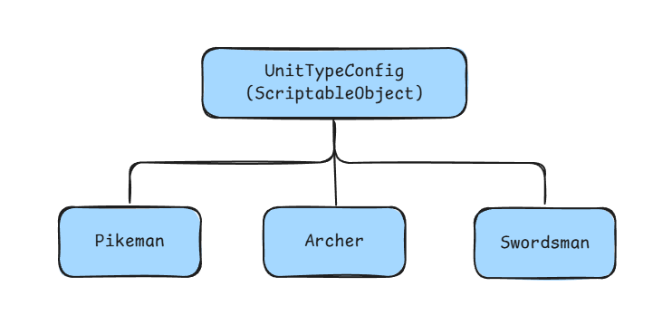

# Introduction
Unity's Entity Component System (ECS) provides an efficient way to store immutable data using **Blob Assets**. This approach is perfect for storing configuration data, which you might typically handle with ScriptableObjects in a MonoBehaviour workflow.



However, transferring configuration data (often stored in ScriptableObjects) to a Blob Asset can be troublesome, requiring you to write a lot of boilerplate code.

The typical proccess is like this:


This tool simplifies the process by handling most of the steps, allowing you to focus on the **"Copy Data to Blob Array"** part.

# Usage
## Creating a Blob Asset
1. Create an `enum` to represent your configuration types.

    ```c#
    public enum UnitType { Pikeman, Archer, ... }.
    ```

2. Create a `struct` to define the structure of your Blob Asset. Use `BlobArray<T>` for collections of data.

    ```c#
    public struct UnitConfigBlob
    {
        public BlobArray<AttackData> combatDataArray;
        public BlobArray<MoveData> moveDataArray;
        ...
    }
    ```

3. Create a component that implements `IConfigComponent<T>`, where `T` is your blob `struct`. This component will be used to access the Blob Asset from your systems.

    ```c#
    public struct UnitConfigRefernce : IConfigComponent<UnitConfigBlob>
    {
        public BlobAssetReference<UnitConfigBlob> blobRef;

        // Implement the interface method
        public void SetBlobRef(BlobAssetReference<SceneConfigBlob> blobRef)
        {
            this.blobRef = blobRef;
        }
    }
    ```

4. Create a ScriptableObject that inherits from `ConfigAsset<TEnum>`, where `TEnum` is the `enum` from step 1.
    - Place this class in a separated `.cs` to ensure correct serialization.

    ```c#
    [CreateAssetMenu(fileName = "UnitConfigAsset", menuName = "Custom")]
    public class UnitConfigAsset : ConfigAsset<UnitType>
    {
        public UnitType type;

        // Implement the abstract property
        public override UnitType Type => type;

        // Your custom config data goes here
        public AttackData combatData;
        public MoveData moveData;
        ...
    }
    ```

5. Create a class that inherits from `ABlobConfig<TAsset, TConfig, TBlob, TEnum>` where:
    - `TAsset` is your `ConfigAsset` class (step 4).
    - `TComponent` is your `IConfigComponent` struct (step 3).
    - `TBlob` is your blob data `struct` (step 2).
    - `TEnum` is your type `enum` (step 1).
  
    Attach this class to a GameObject.

    ```c#
    public class AUnitConfig : ABlobConfig<UnitConfigAsset, UnitConfigRefernce, UnitConfigBlob, UnitType>
    {
        [SerializeField] string loadPath;

        // This is the only boilerplate ;)
        public class Baker : Baker<AUnitConfig>
        {
            public override void Bake(AUnitConfig authoring)
            {
                authoring.Bake(this);
            }
        }

        // Explicitly load the ScriptableObject assets here. 
        // The assets will be automatically sorted according to the enum order.
        protected override void LoadAsset(ref UnitConfigAsset[] assets)
        {
            assets = Resources.LoadAll<UnitConfigAsset>(loadPath);
        }

        // Copy data from the loaded ScriptableObject assets to the blob arrays.
        protected override void TransferData<AUnitConfig>(ref UnitConfigBlob blob, ref BlobBuilder builder, Baker<AUnitConfig> baker)
        {
            Transfer(ref blob.combatDataArray, ref builder, (asset) => asset.combatData);
            Transfer(ref blob.moveDataArray, ref builder, (asset) => asset.moveData);
            ...
        }
    }
    ```

    The `Transfer` method is a helper that copies data into a `BlobArray`. Similarly, you can use `TransferString` to copy `string` data.
    ```c#
    TransferString(ref BlobArray<BlobString> blobArray, ref BlobBuilder builder, Func<TAsset, string> func)
    ```

## Acessing Data
You can access the Blob Asset data from any system.
```c#
// In a SystemBase
public void OnUpdate()
{
    var unityConfigRef = SystemAPI.GetSingleton<UnitConfigRefernce>();
    ref var blob = ref unityConfigRef.blobRef.Value;
    var combatData_Pikeman = blob.combatDataArray[(int)UnitType.Pikeman]

    // It's a good practice to wrap this access logic inside the
    // UnitConfigReference struct to keep your systems cleaner.
}
```